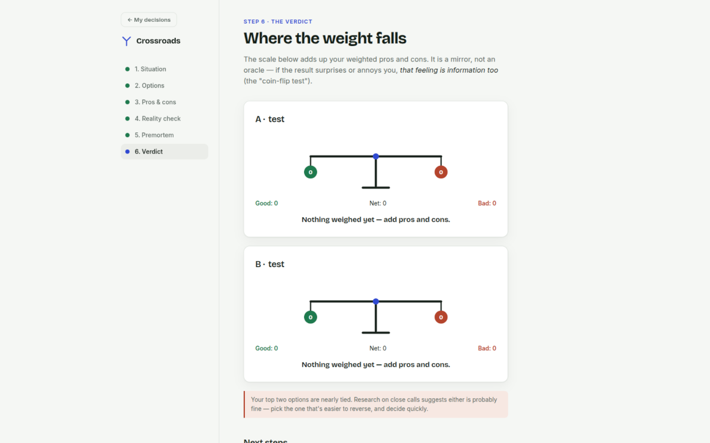
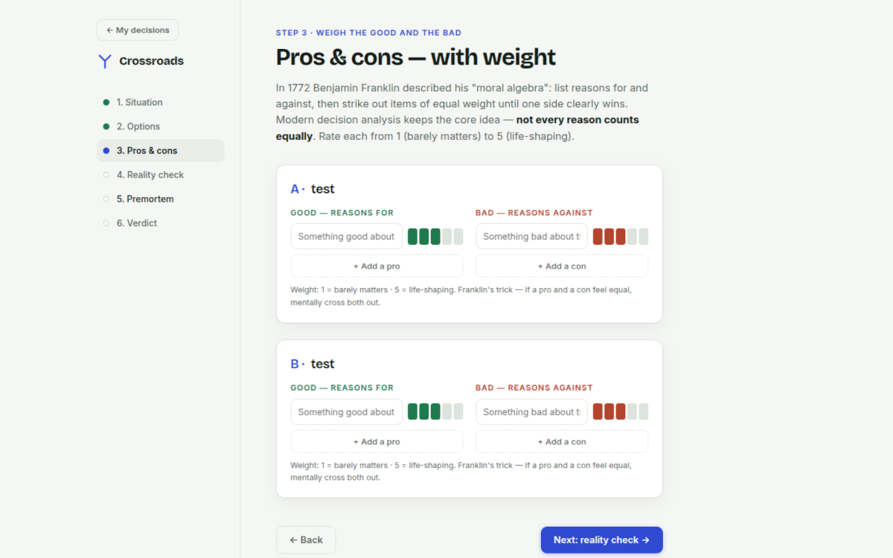
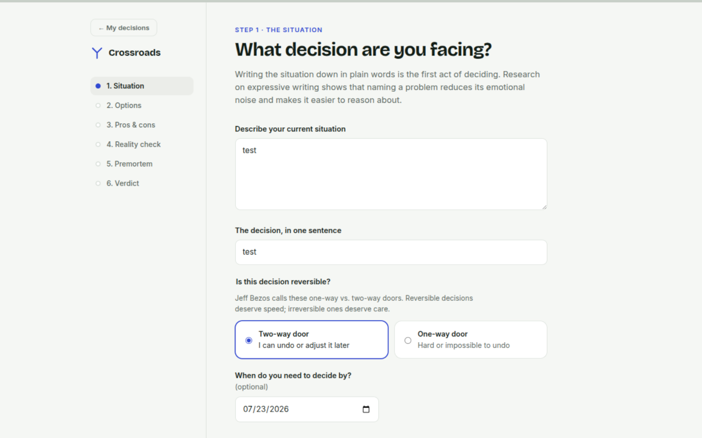

# Crossroads

> A guided, science-based decision helper. No accounts, no server, no tracking — just you and a hard choice.

**Crossroads** walks you through a difficult decision in six short steps, each built on a documented finding from decision science. Describe the situation, list what you could do, weigh the good and the bad, check yourself for the most common thinking traps, imagine failure before it happens, and leave with a verdict and a concrete next step.

Everything runs in your browser. Decisions are saved to your own device (`localStorage`) as a personal journal — open, edit or delete them any time. Nothing ever leaves your machine.

**Live app:** https://crossroads.ivan-sostarko.workers.dev

---

## GitHub description

> Science-based decision helper — weighted pros & cons, bias checks, premortem and next steps. Local-first, zero dependencies, open source.

---

## Screenshots


| Screenshot #1 | Screenshot #2 | Screenshot #3 |
|---|---|---|
|  |  |  |

## The six steps

| # | Step | What you do | The science behind it |
|---|------|-------------|-----------------------|
| 1 | **Situation** | Describe the decision in plain words; mark it as a one-way or two-way door | Expressive writing reduces emotional noise (Pennebaker); reversible vs. irreversible framing (Bezos's "door" heuristic) |
| 2 | **Options** | List at least two real alternatives | Narrow framing is the most common decision failure (Nutt, 1993; Heath & Heath, *Decisive*, 2013) |
| 3 | **Pros & cons — weighted** | List the good and the bad for each option and rate each 1–5 | Benjamin Franklin's 1772 "moral algebra"; modern multi-attribute utility analysis |
| 4 | **Reality check** | Tick through six documented cognitive biases | Kahneman & Tversky's heuristics-and-biases programme |
| 5 | **Premortem** | Imagine the choice failed a year from now and write why | Prospective hindsight improves identification of failure causes by ~30% (Mitchell, Russo & Pennington, 1989; Klein, 2007) |
| 6 | **Verdict** | See the weighted balance, get honest warnings, commit to a first step | Implementation intentions roughly double follow-through (Gollwitzer, 1999) |

A longer write-up with references lives in [`docs/RESEARCH.md`](docs/RESEARCH.md).

## Features

- **Decision journal** — every decision is saved locally; open, keep editing, or delete with confirmation
- **Guided six-step flow** with a persistent progress rail — jump back to any step at any time
- **Weighted pros & cons** (1–5) per option, up to six options
- **Bias checklist**: sunk cost, confirmation bias, loss aversion, social pressure, HALT emotional check, the outside view
- **Premortem** with safeguards and tripwires
- **Animated balance-beam verdict** per option, plus honest, context-aware warnings
- **Export**: download or copy a plain-text summary of the whole decision
- **Polished UX**: page loader, button spinners, stacked toast notifications, custom modal dialogs (no `alert()`/`confirm()`)
- **Responsive** for mobile and tablet, keyboard accessible, respects `prefers-reduced-motion`
- **Autosave** to `localStorage` with a graceful in-memory fallback — zero dependencies, no build step

## Quick start

```bash
git clone https://github.com/ivansostarko/crossroads.git
cd crossroads
# open it directly…
open index.html          # macOS
xdg-open index.html      # Linux
start index.html         # Windows
# …or serve it locally:
python3 -m http.server 8000
```

Then visit `http://localhost:8000`.

## Deploying to Cloudflare Workers

Crossroads is a static site deployed with Cloudflare Workers (static assets):

```bash
npm install -g wrangler
wrangler login
```

Add a `wrangler.toml` to the repo root:

```toml
name = "crossroads"
compatibility_date = "2026-01-01"

[assets]
directory = "."
```

Then deploy:

```bash
wrangler deploy
```

## Project structure

```
crossroads/
├── index.html              # home (journal + screenshots) and the six-step wizard
├── css/
│   └── style.css           # design tokens + all styling, no framework
├── js/
│   └── app.js              # state, journal storage, rendering, scoring, export
├── assets/
│   └── screenshots/        # screen-1..3.png — replace placeholders with real shots
├── docs/
│   └── RESEARCH.md         # the science behind each step, with references
├── CONTRIBUTING.md
├── LICENSE                 # MIT
└── README.md
```

## Philosophy

1. **The tool is a mirror, not an oracle.** The score reflects the weights *you* assigned. If the verdict annoys you, that reaction is data — it's the coin-flip test working.
2. **Local-first.** A decision journal is intimate. Nothing is sent anywhere, ever.
3. **Zero dependencies.** Plain HTML/CSS/JS means the project will still open in a browser in ten years.

## Contributing

Issues and pull requests are welcome — see [`CONTRIBUTING.md`](CONTRIBUTING.md). Good first contributions: translations, additional bias checks (with a citation!), and a print stylesheet.

## Roadmap

- [ ] Print / PDF stylesheet for the summary
- [ ] i18n (starting with Croatian 🇭🇷 and Arabic RTL support)
- [ ] Calibration review: revisit old decisions and record how they turned out
- [ ] Import/export of the full journal as JSON

## License

[MIT](LICENSE) — do whatever you like, just keep the notice.
